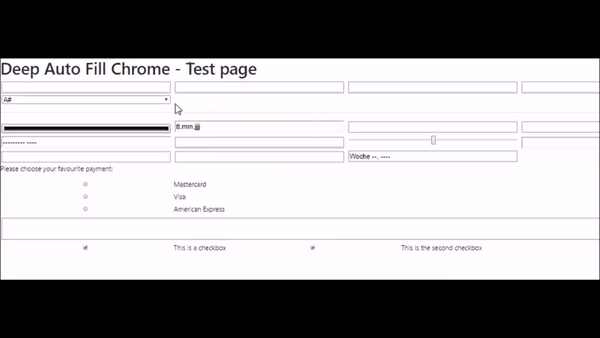

# Deep Autofill Chrome Extension
[](https://chrome.google.com/webstore/detail/deep-auto-fill-chrome/dcanhnkbelfogjbcifegdkgecfammhnk)
[](https://chrome.google.com/webstore/detail/deep-auto-fill-chrome/dcanhnkbelfogjbcifegdkgecfammhnk)

This extension is using faker.js to fill any enabled input element on HTML forms. You can use a `monkey` random mode or define presets in form of `JSON` data in the extension' s options area.

## Installation

[](https://chrome.google.com/webstore/detail/deep-auto-fill-chrome/dcanhnkbelfogjbcifegdkgecfammhnk)

## Demo



## Custom fill settings example

A preset contains an array of setup objects. An example would look like this:

```javascript
{
  "Deep Auto Fill Chrome Demo" : {              // menu item title
    "randomLocale" : "de",                      // reserver for future use
    "fields" : [                                // array of input elements
      {
        "selector" : "#textbox2",               // a valid jQuery selector. Check your dev tools console to see any errors.
        "random": " {{name.lastName}}, {{name.firstName}} {{name.suffix}}"  // randomized faker values described in some form of template language
      },
      {
        "selector" : "input[name=textbox1]",
        "static" : "A static value"             // a static string value. Usefull if you always want the same email address.
      },
      {
        "selector" : "#textbox4"
      }
    ]
  }
}
```

Random values can be equiped with a [faker.js namespaced expression](https://github.com/marak/Faker.js/#api-methods).

If no `static` or `random` value was defined for a field, the extension will guess a cool random value for the input element.

Each `Array` element will be displayed in the browser` s context menu in form of sub or nested context menu item.

This is my first extension for Google Chrome. So the code can be written better for shure. Feedback and pull requests are very welcome.

## License

The MIT License (MIT)

Copyright (c) 2017 Stephan Ahlf
